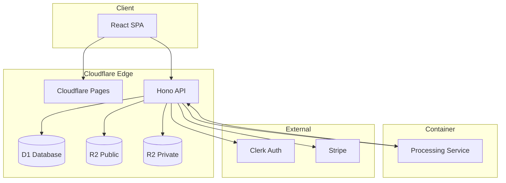
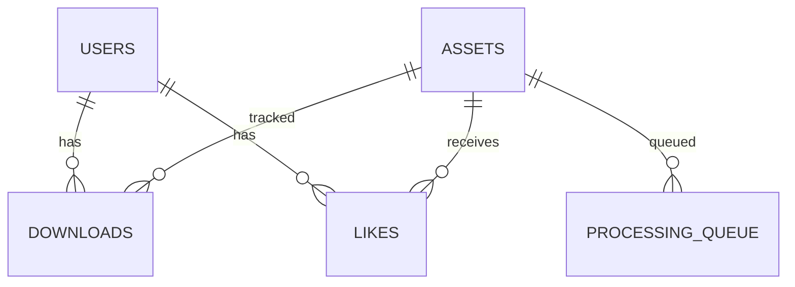

<p align="center">
  
</p>

<h1 align="center">HuePress</h1>

<p align="center">
  <strong>Therapy-Grade Printable Coloring Pages</strong>
</p>

<p align="center">
  A modern SaaS platform delivering high-quality, vector-based coloring pages with a React frontend, Cloudflare Workers API, and container-based PDF generation.
</p>

<p align="center">
  <a href="#features">Features</a> •
  <a href="#tech-stack">Tech Stack</a> •
  <a href="#quick-start">Quick Start</a> •
  <a href="#architecture">Architecture</a> •
  <a href="#api-reference">API</a> •
  <a href="#deployment">Deployment</a>
</p>

---

## Features

- 🎨 **Vector Coloring Pages** — Print-ready PDFs maintain crisp lines at any scale
- 🔐 **Invisible Watermarking** — Track leaked content back to specific users
- 💳 **Subscription System** — Stripe-powered monthly/annual billing
- 🖼️ **Auto-Generated Assets** — Thumbnails, OG images, and PDFs created automatically
- 📱 **Responsive Design** — Beautiful on desktop and mobile
- 🔍 **SEO Optimized** — Dynamic meta tags, sitemaps, IndexNow integration
- 📊 **Analytics Integration** — Meta Pixel, Pinterest, Google Analytics 4
- 🌍 **GDPR Compliant** — Geo-based consent banners for EU users
- 📝 **Built-in Blog** — Markdown-powered content management

---

## Tech Stack

<table>
<tr>
<td><strong>Frontend</strong></td>
<td>React 19, Vite, TailwindCSS, TanStack Query, React Router 7</td>
</tr>
<tr>
<td><strong>Backend</strong></td>
<td>Hono on Cloudflare Workers, D1 (SQLite), R2 Storage</td>
</tr>
<tr>
<td><strong>Processing</strong></td>
<td>Node.js Container with Sharp, PDFKit, svg-to-pdfkit</td>
</tr>
<tr>
<td><strong>Auth</strong></td>
<td>Clerk</td>
</tr>
<tr>
<td><strong>Payments</strong></td>
<td>Stripe</td>
</tr>
<tr>
<td><strong>Validation</strong></td>
<td>Zod</td>
</tr>
</table>

---

## Quick Start

### Prerequisites

| Tool     | Version | Installation                     |
| -------- | ------- | -------------------------------- |
| Node.js  | 20+     | [nodejs.org](https://nodejs.org) |
| pnpm     | 10+     | `npm install -g pnpm`            |
| Wrangler | Latest  | `pnpm add -g wrangler`           |

### Setup

```bash
# 1. Clone the repository
git clone <repo-url>
cd huepress

# 2. Install dependencies
pnpm install

# 3. Configure environment
cp .env.example .env.local
# Fill in VITE_CLERK_PUBLISHABLE_KEY, VITE_STRIPE_PUBLISHABLE_KEY, etc.

# 4. Initialize local database
pnpm run db:migrate

# 5. Start development servers
pnpm run dev        # Frontend on http://localhost:3000
pnpm run dev:api    # API on http://localhost:8787 (separate terminal)
```

### Common Commands

| Command                  | Purpose                              |
| ------------------------ | ------------------------------------ |
| `pnpm run dev`           | Start Vite dev server                |
| `pnpm run dev:api`       | Start Wrangler API locally           |
| `pnpm run build`         | Build for production                 |
| `pnpm run lint`          | Run ESLint                           |
| `pnpm run test`          | Run tests (watch mode)               |
| `pnpm run test:run`      | Run tests once                       |
| `pnpm run deploy:pages`  | Deploy frontend to Cloudflare Pages  |
| `pnpm run deploy:worker` | Deploy API + container to Cloudflare |

---

## Architecture



### Key Flows

**Asset Creation:**

1. Admin uploads SVG via form
2. Worker stores SVG in R2, creates DB record
3. Worker queues processing job
4. Container generates thumbnail (WebP), OG image (PNG), PDF
5. Container uploads generated files to R2

**Asset Download:**

1. User requests download (must be subscribed)
2. Worker fetches PDF from R2 Private
3. Worker applies invisible watermark with user ID
4. Worker returns watermarked PDF

**Background Processing:**

```
Cron (*/5 * * * *) → Check queue → Wake container → Process pending jobs
```

---

## Project Structure

```
huepress/
├── container/              # Processing container
│   ├── lib/
│   │   ├── generators.js   # PDF, thumbnail, OG generation
│   │   ├── queue.js        # Job queue processing
│   │   └── utils.js        # SVG sanitization, helpers
│   ├── Dockerfile
│   └── server.js           # Express endpoints
├── migrations/             # D1 SQL migrations (13 files)
├── src/
│   ├── api/                # Backend API
│   │   ├── routes/         # Route handlers
│   │   └── index.ts        # Hono app entry
│   ├── components/         # React components
│   │   ├── ui/             # Reusable UI components
│   │   ├── layout/         # Layout components
│   │   └── features/       # Feature components
│   ├── lib/                # Shared utilities
│   │   ├── api-client.ts   # Frontend API client
│   │   └── pdf-watermark.ts
│   ├── pages/              # Page components
│   ├── App.tsx             # Routing
│   └── main.tsx            # Entry point
├── tests/                  # Test suites
├── wrangler.toml           # Cloudflare config
└── package.json
```

---

## API Reference

### Public Endpoints

| Method | Endpoint                | Description                  |
| ------ | ----------------------- | ---------------------------- |
| `GET`  | `/api/assets`           | List published assets        |
| `GET`  | `/api/assets/:id`       | Get single asset             |
| `GET`  | `/api/download/:id`     | Download PDF (auth required) |
| `GET`  | `/api/tags`             | List all tags                |
| `GET`  | `/api/posts`            | List blog posts              |
| `GET`  | `/api/posts/:slug`      | Get blog post                |
| `GET`  | `/api/reviews/:assetId` | Get asset reviews            |
| `POST` | `/api/reviews`          | Submit review                |
| `POST` | `/api/requests/submit`  | Submit design request        |

### User Endpoints (Auth Required)

| Method | Endpoint                   | Description          |
| ------ | -------------------------- | -------------------- |
| `GET`  | `/api/user/likes`          | Get liked assets     |
| `POST` | `/api/user/likes/:assetId` | Toggle like          |
| `GET`  | `/api/user/history`        | Get download history |
| `POST` | `/api/user/activity`       | Record activity      |

### Billing Endpoints

| Method | Endpoint        | Description            |
| ------ | --------------- | ---------------------- |
| `POST` | `/api/checkout` | Create Stripe checkout |
| `POST` | `/api/portal`   | Create customer portal |

### Admin Endpoints

| Method                | Endpoint                            | Description         |
| --------------------- | ----------------------------------- | ------------------- |
| `GET`                 | `/api/admin/assets`                 | List all assets     |
| `POST`                | `/api/admin/assets`                 | Create/update asset |
| `DELETE`              | `/api/admin/assets/:id`             | Delete asset        |
| `POST`                | `/api/admin/assets/bulk-regenerate` | Regenerate assets   |
| `GET`                 | `/api/admin/stats`                  | Dashboard stats     |
| `GET/POST/PUT/DELETE` | `/api/admin/posts/*`                | Blog management     |

---

## Database Schema

### Core Tables

| Table              | Purpose                                           |
| ------------------ | ------------------------------------------------- |
| `assets`           | Coloring pages with metadata, R2 keys, SEO fields |
| `users`            | Synced from Clerk, subscription status            |
| `downloads`        | Download/print history                            |
| `likes`            | User favorites                                    |
| `reviews`          | User reviews with ratings                         |
| `posts`            | Blog content                                      |
| `design_requests`  | Custom design requests                            |
| `processing_queue` | Background job status                             |



---

## Configuration

### Environment Variables

#### Frontend (.env.local)

```env
VITE_CLERK_PUBLISHABLE_KEY=pk_...
VITE_STRIPE_PUBLISHABLE_KEY=pk_...
VITE_APP_URL=http://localhost:3000
VITE_API_URL=http://localhost:8787
```

#### Backend (Wrangler Secrets)

```bash
wrangler secret put CLERK_SECRET_KEY
wrangler secret put STRIPE_SECRET_KEY
wrangler secret put STRIPE_WEBHOOK_SECRET
wrangler secret put CONTAINER_AUTH_SECRET
wrangler secret put INTERNAL_API_TOKEN
```

#### Production (wrangler.toml)

```toml
[vars]
ENVIRONMENT = "production"
API_URL = "https://api.huepress.co"
SITE_URL = "https://huepress.co"
ASSETS_CDN_URL = "https://assets.huepress.co"
```

---

## Deployment

### Frontend (Cloudflare Pages)

```bash
pnpm run build
pnpm run deploy:pages
```

### Backend (Cloudflare Workers + Container)

```bash
pnpm run deploy:worker
```

To force container image rebuild:

```bash
pnpm run deploy:worker -- --force
```

### Database Migrations

```bash
# Local
pnpm run db:migrate

# Production
pnpm run db:migrate:prod
```

---

## Development

### Testing

```bash
# Watch mode
pnpm run test

# Single run with coverage
pnpm run test:run
```

### Linting

```bash
pnpm run lint
```

### Workflows

The project includes automation workflows in `.agent/workflows/`:

| Workflow   | Purpose                                |
| ---------- | -------------------------------------- |
| `/analyze` | Deep codebase analysis, README updates |
| `/audit`   | Security and quality audit             |
| `/commit`  | Lint, test, and commit changes         |
| `/deploy`  | Full production deployment             |
| `/fix`     | Iteratively fix lint/test errors       |

---

## Troubleshooting

### Common Issues

**Wrangler not found**

```bash
pnpm add -g wrangler
# or use pnpm exec wrangler
```

**Local database errors**

```bash
pnpm run db:migrate
```

**API connection issues**

- Ensure `pnpm run dev:api` is running
- Check `vite.config.ts` proxy points to port 8787

**Container not processing**

- Check Cloudflare dashboard for container logs
- Verify `CONTAINER_AUTH_SECRET` and `INTERNAL_API_TOKEN` are set

---

## Contributing

1. Create a feature branch from `main`
2. Make changes
3. Run lint and tests: `pnpm run lint && pnpm run test:run`
4. Add migrations if schema changes
5. Open a PR with clear description

---

## Documentation

| Document                                               | Purpose                  |
| ------------------------------------------------------ | ------------------------ |
| [CODEBASE_ANALYSIS.md](docs/CODEBASE_ANALYSIS.md)      | Deep technical analysis  |
| [TRACKING.md](docs/TRACKING.md)                        | Analytics implementation |
| [design-system.md](docs/design-system-for-huepress.md) | UI/UX guidelines         |
| [business-plan.md](docs/business-plan-huepress.md)     | Business strategy        |

---

## License

Proprietary. All rights reserved.

---

<p align="center">
  <sub>Built with ❤️ by the HuePress team</sub>
</p>
