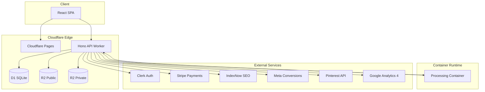
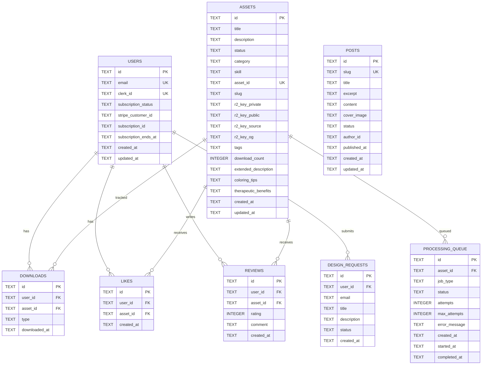

# HuePress Codebase Analysis

> **Generated**: December 28, 2025  
> **Source Files**: 133  
> **Database Tables**: 7  
> **API Endpoints**: 50+

---

## Table of Contents

- [Architecture Overview](#architecture-overview)
- [Technology Stack](#technology-stack)
- [Directory Structure](#directory-structure)
- [Frontend Analysis](#frontend-analysis)
- [Backend API Analysis](#backend-api-analysis)
- [Processing Container](#processing-container)
- [Database Schema](#database-schema)
- [API Endpoint Reference](#api-endpoint-reference)
- [Environment Variables](#environment-variables)
- [NPM Scripts](#npm-scripts)
- [Test Coverage](#test-coverage)
- [Dependency Inventory](#dependency-inventory)

---

## Architecture Overview

HuePress is a **full-stack monorepo** for a SaaS platform providing therapy-grade, printable coloring pages. The architecture follows a modern edge-computing pattern:



### Key Data Flows

1. **User Authentication**: Browser → Clerk SDK → Worker validates JWT via `clerkMiddleware`
2. **Asset Creation**: Admin uploads SVG → Worker stores in R2 → Triggers Container → Container generates PDF/images → Uploads to R2
3. **Asset Download**: User requests download → Worker verifies subscription → Fetches from R2 Private → Applies invisible watermark → Returns PDF
4. **Background Processing**: Cron job (every 5 min) → Checks queue → Wakes container → Container processes pending jobs

---

## Technology Stack

### Frontend

| Technology     | Version | Purpose                 |
| -------------- | ------- | ----------------------- |
| React          | 19.0.0  | UI Framework            |
| Vite           | 6.0.5   | Build Tool & Dev Server |
| TailwindCSS    | 3.4.1   | Styling                 |
| TanStack Query | 5.90.12 | Server State Management |
| React Router   | 7.1.1   | Client-side Routing     |
| Clerk React    | 5.59.2  | Authentication UI       |
| Lucide React   | 0.460.0 | Icons                   |
| Sonner         | 2.0.7   | Toast Notifications     |

### Backend

| Technology         | Version | Purpose              |
| ------------------ | ------- | -------------------- |
| Hono               | 4.6.15  | API Framework        |
| Cloudflare Workers | -       | Serverless Runtime   |
| Cloudflare D1      | -       | SQLite Database      |
| Cloudflare R2      | -       | Object Storage       |
| Zod                | 4.2.1   | Request Validation   |
| Stripe             | 20.1.0  | Payment Processing   |
| Svix               | 1.82.0  | Webhook Verification |

### Processing Container

| Technology    | Version | Purpose              |
| ------------- | ------- | -------------------- |
| Node.js       | 20      | Runtime              |
| Express       | -       | HTTP Server          |
| Sharp         | -       | Image Processing     |
| PDFKit        | -       | PDF Generation       |
| svg-to-pdfkit | -       | Vector SVG to PDF    |
| p-queue       | -       | Job Queue Management |

---

## Directory Structure

```
huepress/
├── .agent/                     # AI agent workflows
│   └── workflows/              # Automation workflows (analyze, audit, commit, deploy, fix)
├── container/                  # Processing container (Docker)
│   ├── lib/                    # Modular logic
│   │   ├── generators.js       # PDF, thumbnail, OG image generation
│   │   ├── queue.js            # Background job processing
│   │   └── utils.js            # Helper functions, SVG sanitization
│   ├── fonts/                  # Custom fonts (Inter)
│   ├── Dockerfile              # Node.js 20 slim image
│   ├── server.js               # Express app entry point
│   ├── og_template.svg         # OG image template
│   └── marketing_template.svg  # PDF page 2 template
├── docs/                       # Documentation & business docs
├── migrations/                 # D1 SQL migrations (13 files)
├── public/                     # Static assets
├── scripts/                    # Utility scripts
│   ├── generate-sitemap.js     # SEO sitemap generator
│   └── compress-images.sh      # Image optimization
├── src/
│   ├── api/                    # Backend API
│   │   ├── index.ts            # Hono app entry, middleware, worker export
│   │   ├── lib/                # API utilities (verify-admin)
│   │   ├── routes/             # Route handlers (10 files)
│   │   └── types.ts            # TypeScript bindings
│   ├── components/             # React components
│   │   ├── ui/                 # Reusable UI (14 components)
│   │   ├── auth/               # Auth components
│   │   ├── layout/             # Layout components
│   │   ├── features/           # Feature-specific components
│   │   ├── privacy/            # GDPR consent components
│   │   └── checkout/           # Stripe checkout
│   ├── context/                # React contexts
│   │   └── ConsentContext.tsx  # GDPR consent state
│   ├── hooks/                  # Custom hooks
│   │   └── useDebounce.ts      # Debounce utility
│   ├── lib/                    # Shared utilities
│   │   ├── api-client.ts       # Frontend API client (386 lines)
│   │   ├── analytics.ts        # Analytics helpers
│   │   ├── pdf-watermark.ts    # Invisible PDF watermarking
│   │   ├── processing-container.ts # Container client
│   │   └── *-conversions.ts    # Meta, Pinterest, GA4 tracking
│   ├── pages/                  # Page components (14 pages + admin)
│   │   └── admin/              # Admin dashboard pages
│   ├── providers/              # React providers
│   │   └── QueryProvider.tsx   # TanStack Query setup
│   ├── App.tsx                 # Main app with routing
│   ├── main.tsx                # Entry point with providers
│   └── index.css               # Global styles
├── tests/                      # Test suites (18 test files)
│   ├── api/                    # API route tests
│   ├── lib/                    # Utility tests
│   └── hooks/                  # Hook tests
└── Configuration Files
    ├── package.json            # Dependencies & scripts
    ├── wrangler.toml           # Cloudflare config
    ├── vite.config.ts          # Vite build config
    ├── vitest.config.ts        # Test config
    ├── tailwind.config.ts      # Tailwind theme
    ├── tsconfig.json           # TypeScript config
    └── eslint.config.js        # Linting rules
```

---

## Frontend Analysis

### App Structure

The frontend uses React 19 with a provider-wrapped architecture:

```tsx
<StrictMode>
  <ClerkProvider>
    {" "}
    {/* Authentication */}
    <QueryProvider>
      {" "}
      {/* TanStack Query */}
      <HelmetProvider>
        {" "}
        {/* SEO meta tags */}
        <BrowserRouter>
          <ConsentProvider>
            {" "}
            {/* GDPR consent */}
            <App />
          </ConsentProvider>
        </BrowserRouter>
      </HelmetProvider>
    </QueryProvider>
  </ClerkProvider>
</StrictMode>
```

### Routing

| Route                   | Component          | Access       |
| ----------------------- | ------------------ | ------------ |
| `/`                     | HomePage           | Public       |
| `/vault`                | VaultPage          | Public       |
| `/vault/:id`            | ResourceDetailPage | Public       |
| `/coloring-pages/:slug` | ResourceDetailPage | Public (SEO) |
| `/pricing`              | PricingPage        | Public       |
| `/about`                | AboutPage          | Public       |
| `/blog`                 | BlogIndex          | Public       |
| `/blog/:slug`           | BlogPost           | Public       |
| `/request-design`       | RequestDesignPage  | Auth         |
| `/dashboard`            | UserDashboard      | Auth         |
| `/settings`             | SettingsPage       | Auth         |
| `/onboarding`           | OnboardingPage     | Auth         |
| `/admin/*`              | AdminLayout        | Admin        |

### Code Splitting

All pages except `HomePage` are lazy-loaded for performance:

```tsx
const VaultPage = lazy(() => import("./pages/Vault"));
```

### UI Component Library

14 reusable components in `src/components/ui/`:

- **Layout**: Card, Section, Pagination
- **Forms**: Button, Input, Combobox, SearchBar, FilterChip
- **Feedback**: Badge, AlertModal
- **Data Display**: ResourceCard, Typography, Accordion

### State Management

- **Server State**: TanStack Query with 60s stale time
- **Auth State**: Clerk SDK hooks
- **Consent State**: React Context (`ConsentContext`)
- **Form State**: Local component state

---

## Backend API Analysis

### Entry Point (`src/api/index.ts`)

```typescript
const app = new Hono<{ Bindings: Bindings }>();

// 1. CORS Middleware - Restricts to known origins
app.use("*", cors({ origin: [SITE_URL, "localhost:3000", "localhost:5173"] }));

// 2. GeoIP Endpoint - Before auth for consent checks
app.get("/api/geo", ...);

// 3. Clerk Auth Middleware
app.use("*", clerkMiddleware());

// 4. Mount Route Handlers
app.route("/api", assetsRoute);
app.route("/api/admin", adminRoute);
app.route("/api", stripeRoute);
// ... more routes
```

### Route Modules

| File          | Prefix          | Purpose                                          |
| ------------- | --------------- | ------------------------------------------------ |
| `assets.ts`   | `/api`          | Public asset listing, single asset, downloads    |
| `admin.ts`    | `/api/admin`    | Asset CRUD, bulk operations, stats, regeneration |
| `blog.ts`     | `/api`          | Blog posts (public + admin)                      |
| `stripe.ts`   | `/api`          | Checkout, portal, webhooks                       |
| `webhooks.ts` | `/api/webhooks` | Clerk user sync                                  |
| `reviews.ts`  | `/api/reviews`  | User reviews                                     |
| `tags.ts`     | `/api/tags`     | Tag management                                   |
| `user.ts`     | `/api/user`     | Likes, history, activity                         |
| `internal.ts` | `/api/internal` | Container-to-worker communication                |
| `requests.ts` | `/api/requests` | Design requests                                  |

### Authentication Flow

1. Frontend includes Clerk JWT in `Authorization: Bearer <token>`
2. `clerkMiddleware()` validates token, attaches `auth` to context
3. Route handlers use `getAuth(c)` to access user info
4. Admin routes use `verifyAdmin(c)` for role checking

### Request Validation

Zod schemas validate incoming data:

```typescript
const requestSubmitSchema = z.object({
  title: z.string().min(1).max(200),
  description: z.string().min(1).max(2000),
  email: z.string().email().max(254)
});

app.post("/api/requests/submit", zValidator("json", requestSubmitSchema), ...);
```

---

## Processing Container

### Architecture

The container is a Node.js Express app running on Cloudflare Containers:

```
container/
├── server.js           # Express app, orchestrates endpoints
├── lib/
│   ├── generators.js   # Image/PDF generation logic
│   ├── queue.js        # Background job processing
│   └── utils.js        # SVG sanitization, fetch helpers
```

### Endpoints

| Endpoint        | Method | Purpose                                       |
| --------------- | ------ | --------------------------------------------- |
| `/health`       | GET    | Health check                                  |
| `/wakeup`       | GET    | Wake container, trigger queue processing      |
| `/thumbnail`    | POST   | Generate WebP thumbnail with watermark banner |
| `/og-image`     | POST   | Generate OG image (1200x630 PNG)              |
| `/pdf`          | POST   | Generate vector PDF with marketing page       |
| `/generate-all` | POST   | Orchestrate all 3 generations                 |

### Generation Logic

**Thumbnail** (`generateThumbnailBuffer`):

- Renders SVG at 600x600
- Adds branded footer banner with logo, ID, copyright
- Outputs WebP (85% quality)

**OG Image** (`generateOgBuffer`):

- 1200x630 dimensions for social sharing
- Overlay template with art and wrapped title text
- Balanced line-breaking algorithm for titles
- Outputs PNG

**PDF** (`generatePdfBuffer`):

- A4 with dynamic orientation (portrait/landscape)
- Page 1: Vector SVG art centered with margins
- Page 2: Marketing template with tips, social links, QR codes
- Uses PDFKit + svg-to-pdfkit for true vector output

### Queue Processing

Jobs are inserted into `processing_queue` table by Worker, processed by Container:

```javascript
async function processQueue() {
  const jobs = await fetch("/api/internal/queue/pending");
  for (const job of jobs) {
    // 1. Set status to "processing"
    // 2. Fetch asset metadata + SVG content
    // 3. Generate thumbnail, OG, PDF
    // 4. Upload each to R2 via internal API
    // 5. Set status to "completed" or "failed"
  }
}
```

---

## Database Schema

### Entity Relationship Diagram



### Migration History

| Migration                      | Description                                       |
| ------------------------------ | ------------------------------------------------- |
| 001_init.sql                   | Core tables: assets, users, downloads             |
| 002_reviews.sql                | User reviews with ratings                         |
| 003_seo_enhancements.sql       | Extended descriptions, tips, therapeutic benefits |
| 004_add_source_file.sql        | r2_key_source for SVG storage                     |
| 005_design_requests.sql        | Custom design request tracking                    |
| 006_sequences.sql              | Auto-incrementing asset IDs                       |
| 007_og_images.sql              | r2_key_og for OG images                           |
| 008_user_interactions.sql      | Likes table, download types                       |
| 009_blog_posts.sql             | Blog content management                           |
| 010_add_missing_categories.sql | Category expansions                               |
| 011_performance_indexes.sql    | Query optimization indexes                        |
| 012_processing_queue.sql       | Background job queue                              |
| 013_queue_optimization.sql     | Queue performance indexes                         |

---

## API Endpoint Reference

### Public Endpoints

| Method | Path                    | Description                                   | Auth     |
| ------ | ----------------------- | --------------------------------------------- | -------- |
| GET    | `/api/health`           | Health check                                  | No       |
| GET    | `/api/geo`              | Get user's country code                       | No       |
| GET    | `/api/assets`           | List published assets (paginated, filterable) | No       |
| GET    | `/api/assets/:id`       | Get single asset by ID/slug                   | No       |
| GET    | `/api/download/:id`     | Download PDF (watermarked)                    | Yes      |
| GET    | `/api/tags`             | List all used tags                            | No       |
| GET    | `/api/posts`            | List published blog posts                     | No       |
| GET    | `/api/posts/:slug`      | Get blog post by slug                         | No       |
| GET    | `/api/reviews/:assetId` | Get reviews for asset                         | No       |
| POST   | `/api/reviews`          | Submit a review                               | Yes      |
| POST   | `/api/requests/submit`  | Submit design request                         | Optional |

### User Endpoints

| Method | Path                              | Description                    |
| ------ | --------------------------------- | ------------------------------ |
| GET    | `/api/user/likes`                 | Get user's liked assets        |
| GET    | `/api/user/likes/:assetId/status` | Check if asset is liked        |
| POST   | `/api/user/likes/:assetId`        | Toggle like on asset           |
| GET    | `/api/user/history`               | Get download/print history     |
| POST   | `/api/user/activity`              | Record download/print activity |

### Billing Endpoints

| Method | Path                   | Description                    |
| ------ | ---------------------- | ------------------------------ |
| POST   | `/api/checkout`        | Create Stripe checkout session |
| POST   | `/api/portal`          | Create Stripe customer portal  |
| POST   | `/api/webhooks/stripe` | Handle Stripe webhooks         |

### Admin Endpoints

| Method | Path                                      | Description                        |
| ------ | ----------------------------------------- | ---------------------------------- |
| GET    | `/api/admin/assets`                       | List all assets (including drafts) |
| GET    | `/api/admin/assets/:id`                   | Get asset with full details        |
| GET    | `/api/admin/assets/:id/source`            | Get raw SVG source                 |
| POST   | `/api/admin/create-draft`                 | Create draft asset                 |
| POST   | `/api/admin/assets`                       | Create/update asset with files     |
| PATCH  | `/api/admin/assets/:id/status`            | Update publish status              |
| DELETE | `/api/admin/assets/:id`                   | Delete asset                       |
| POST   | `/api/admin/assets/bulk-delete`           | Bulk delete assets                 |
| POST   | `/api/admin/assets/bulk-status`           | Bulk update status                 |
| POST   | `/api/admin/assets/bulk-regenerate`       | Regenerate assets                  |
| POST   | `/api/admin/assets/:id/regenerate-og`     | Regenerate OG image                |
| GET    | `/api/admin/assets/:id/processing-status` | Get queue status                   |
| GET    | `/api/admin/stats`                        | Dashboard statistics               |
| GET    | `/api/admin/requests`                     | List design requests               |
| PATCH  | `/api/admin/requests/:id`                 | Update request status              |
| GET    | `/api/admin/posts`                        | List all blog posts                |
| GET    | `/api/admin/posts/:id`                    | Get blog post for editing          |
| POST   | `/api/admin/posts`                        | Create blog post                   |
| PUT    | `/api/admin/posts/:id`                    | Update blog post                   |
| DELETE | `/api/admin/posts/:id`                    | Delete blog post                   |

### Internal Endpoints (Container ↔ Worker)

| Method | Path                           | Description                    |
| ------ | ------------------------------ | ------------------------------ |
| PUT    | `/api/internal/upload-private` | Upload to R2 private           |
| PUT    | `/api/internal/upload-public`  | Upload to R2 public            |
| PUT    | `/api/internal/upload-pdf`     | Upload PDF to R2               |
| GET    | `/api/internal/queue/pending`  | Get pending jobs               |
| PATCH  | `/api/internal/queue/:id`      | Update job status              |
| GET    | `/api/internal/assets/:id`     | Get asset + SVG for processing |

---

## Environment Variables

### Frontend (Vite)

| Variable                      | Description                       | Required |
| ----------------------------- | --------------------------------- | -------- |
| `VITE_CLERK_PUBLISHABLE_KEY`  | Clerk public key                  | Yes      |
| `VITE_STRIPE_PUBLISHABLE_KEY` | Stripe public key                 | Yes      |
| `VITE_APP_URL`                | App URL (default: localhost:3000) | No       |
| `VITE_API_URL`                | API URL (default: localhost:8787) | No       |

### Backend (Wrangler Secrets)

| Variable                 | Description             | Required |
| ------------------------ | ----------------------- | -------- |
| `CLERK_SECRET_KEY`       | Clerk secret key        | Yes      |
| `STRIPE_SECRET_KEY`      | Stripe secret key       | Yes      |
| `STRIPE_WEBHOOK_SECRET`  | Stripe webhook signing  | Yes      |
| `STRIPE_PRICE_MONTHLY`   | Monthly price ID        | Yes      |
| `STRIPE_PRICE_ANNUAL`    | Annual price ID         | Yes      |
| `CONTAINER_AUTH_SECRET`  | Container ↔ Worker auth | Yes      |
| `INTERNAL_API_TOKEN`     | Internal API token      | Yes      |
| `META_ACCESS_TOKEN`      | Meta Conversions API    | Optional |
| `PINTEREST_ACCESS_TOKEN` | Pinterest API           | Optional |
| `GA4_API_SECRET`         | Google Analytics 4 API  | Optional |

### Backend (wrangler.toml vars)

| Variable                  | Value                      |
| ------------------------- | -------------------------- |
| `ENVIRONMENT`             | production                 |
| `API_URL`                 | https://api.huepress.co    |
| `SITE_URL`                | https://huepress.co        |
| `ASSETS_CDN_URL`          | https://assets.huepress.co |
| `META_PIXEL_ID`           | 1588901548777498           |
| `GA4_MEASUREMENT_ID`      | G-QTF6MPM5SQ               |
| `PINTEREST_AD_ACCOUNT_ID` | 549769812316               |

---

## Package Manager & Scripts

> **Package Manager**: pnpm 10.13.1 (configured in `package.json`)
>
> Run scripts with `pnpm run <script>` or `pnpm <script>`

| Script            | Command                           | Purpose                               |
| ----------------- | --------------------------------- | ------------------------------------- |
| `dev`             | `vite`                            | Start frontend dev server (port 3000) |
| `dev:api`         | `wrangler dev --port 8787`        | Start API locally                     |
| `build`           | `tsc -b && vite build`            | Build frontend + types                |
| `preview`         | `vite preview`                    | Preview production build              |
| `lint`            | `eslint .`                        | Run ESLint                            |
| `test`            | `vitest`                          | Run tests in watch mode               |
| `test:run`        | `vitest run`                      | Run tests once                        |
| `deploy:pages`    | `wrangler pages deploy dist`      | Deploy frontend                       |
| `deploy:worker`   | `wrangler deploy`                 | Deploy API + container                |
| `db:migrate`      | `wrangler d1 execute ... --local` | Run migrations locally                |
| `db:migrate:prod` | `wrangler d1 execute ...`         | Run migrations in production          |

---

## Test Coverage

### Test Files (18)

| Category   | Files                                                                                                           |
| ---------- | --------------------------------------------------------------------------------------------------------------- |
| API Routes | admin, assets, blog, internal, requests, reviews, stripe, tags, user, webhooks                                  |
| Libraries  | ga4-conversions, indexnow, meta-conversions, pinterest-conversions, processing-container, stripe-webhook, utils |
| Hooks      | useDebounce                                                                                                     |

### Test Framework

- **Runner**: Vitest 4.0.16
- **Pool**: @cloudflare/vitest-pool-workers (for Worker tests)
- **DOM**: jsdom 27.3.0
- **Coverage**: @vitest/coverage-v8

---

## Dependency Inventory

### Production Dependencies (26)

**Framework & Runtime**

- react, react-dom (19.0.0) - UI framework
- hono (4.6.15) - API framework
- react-router-dom (7.1.1) - Routing

**State & Data**

- @tanstack/react-query (5.90.12) - Server state
- zod (4.2.1) - Validation

**Authentication**

- @clerk/clerk-react (5.59.2) - Auth UI
- @clerk/backend (2.29.0) - Auth utilities
- @hono/clerk-auth (2.0.0) - Hono integration

**Payments**

- stripe (20.1.0) - Server SDK
- @stripe/stripe-js (8.6.0) - Client SDK

**Infrastructure**

- @cloudflare/containers (0.0.31) - Container bindings
- @hono/zod-validator (0.7.6) - Validation middleware

**UI & Styling**

- lucide-react (0.460.0) - Icons
- clsx (2.1.1), tailwind-merge (3.4.0) - Class utilities
- sonner (2.0.7) - Toasts
- @tailwindcss/typography (0.5.19) - Prose styling
- react-helmet-async (2.0.5) - SEO meta

**Content**

- react-markdown (10.1.0), remark-gfm (4.0.1) - Markdown
- easymde (2.20.0), react-simplemde-editor (5.2.0) - Editor

**PDF**

- pdf-lib (1.17.1) - PDF manipulation
- @resvg/resvg-wasm (2.6.2) - SVG rendering

**Webhooks**

- svix (1.82.0) - Webhook verification

### Dev Dependencies (23)

**Build**

- vite (6.0.5), @vitejs/plugin-react (4.3.4)
- typescript (5.7.2), jiti (2.6.1)

**Testing**

- vitest (4.0.16), @cloudflare/vitest-pool-workers (0.11.1)
- @testing-library/react (16.3.1), @testing-library/dom (10.4.1)
- jsdom (27.3.0), @vitest/coverage-v8 (4.0.16)

**Linting**

- eslint (9), eslint-plugin-react-hooks, eslint-plugin-react-refresh
- typescript-eslint (8.50.1)

**Styling**

- tailwindcss (3.4.1), autoprefixer (10.4.20), postcss (8)

**Types**

- @cloudflare/workers-types (4.20241218.0)
- @types/node (25.0.3), @types/react (19), @types/react-dom (19)
- @types/qrcode (1.5.6)

**Cloudflare**

- wrangler (4.56.0)

**Utilities**

- globals (16.5.0)
