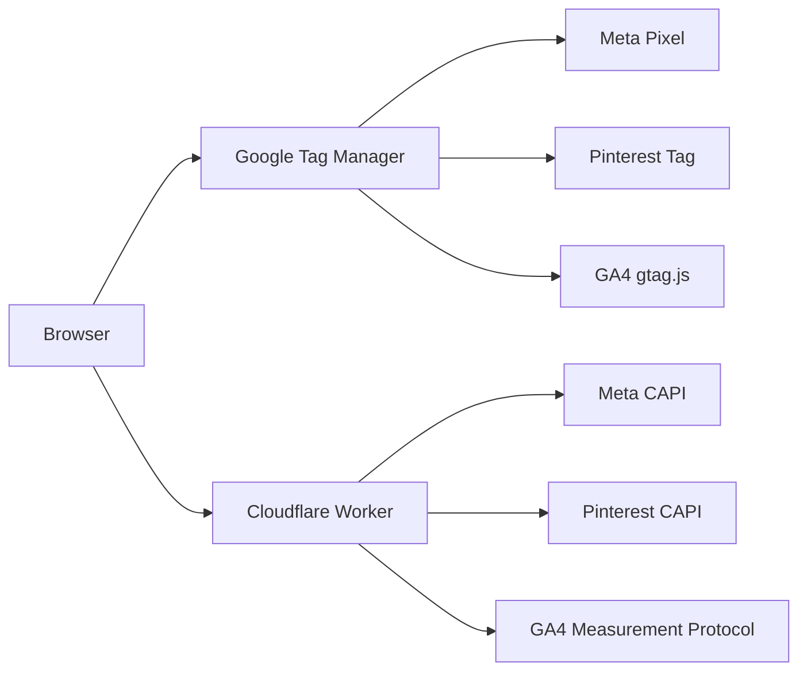

# HuePress Tracking Stack

This document describes the complete tracking implementation for analytics and conversion optimization.

## Architecture Overview



## Client-Side Tracking (GTM)

| Platform          | Tag ID             | Events                          |
| ----------------- | ------------------ | ------------------------------- |
| **Meta Pixel**    | `1588901548777498` | PageView, SubscribedButtonClick |
| **Pinterest Tag** | `2613563536774`    | PageVisit, Checkout             |
| **GA4**           | `G-QTF6MPM5SQ`     | page_view, all automatic events |

**GTM Container ID:** `GTM-K9KM3953`

## Server-Side Tracking (Cloudflare Worker)

### Meta Conversions API (CAPI)

| Event                  | Trigger                           | File          |
| ---------------------- | --------------------------------- | ------------- |
| `Purchase`             | Stripe checkout.session.completed | `stripe.ts`   |
| `Subscribe`            | Stripe checkout.session.completed | `stripe.ts`   |
| `CompleteRegistration` | Clerk user.created                | `webhooks.ts` |

**EMQ Data Sent:** email (hashed), external_id (hashed), client_ip, user_agent, fbp, fbc

### Pinterest Conversions API

| Event      | Trigger                           | File        |
| ---------- | --------------------------------- | ----------- |
| `checkout` | Stripe checkout.session.completed | `stripe.ts` |

**EMQ Data Sent:** email (hashed), external_id (hashed), client_ip, user_agent

### GA4 Measurement Protocol

| Event      | Trigger                           | File          |
| ---------- | --------------------------------- | ------------- |
| `purchase` | Stripe checkout.session.completed | `stripe.ts`   |
| `sign_up`  | Clerk user.created                | `webhooks.ts` |

**Data Sent:** transaction_id, value, currency, user_id

## Environment Variables

### Secrets (set via `wrangler secret put`)

- `META_ACCESS_TOKEN` — Meta Conversions API token
- `PINTEREST_ACCESS_TOKEN` — Pinterest API token
- `GA4_API_SECRET` — GA4 Measurement Protocol secret

### Vars (in wrangler.toml)

- `META_PIXEL_ID` — `1588901548777498`
- `PINTEREST_AD_ACCOUNT_ID` — `549769812316`
- `GA4_MEASUREMENT_ID` — `G-QTF6MPM5SQ`

## Privacy & Consent

- **Consent Mode v2:** GTM tags respect Google Consent Mode defaults
- **GPC Support:** Global Privacy Control is honored
- **PII Hashing:** Email and external_id are SHA-256 hashed before transmission
- **EU Waiver Modal:** Shown to all users before checkout

## Verification

### Meta Events Manager

1. Go to [facebook.com/events_manager](https://facebook.com/events_manager)
2. Select Pixel → Overview or History tab
3. Look for Purchase, Subscribe, CompleteRegistration events

### Pinterest Conversions

1. Go to [ads.pinterest.com](https://ads.pinterest.com) → Conversions
2. Select Tag → Event History
3. Look for checkout events

### GA4 Realtime

1. Go to [analytics.google.com](https://analytics.google.com)
2. Reports → Realtime → Events
3. Look for purchase, sign_up events

### Wrangler Tail (Live Logs)

```bash
wrangler tail
```

Look for log messages like:

- `Meta Purchase event sent for: xxx`
- `GA4 Purchase event sent for: xxx`
- `Pinterest Checkout event sent for: xxx`
